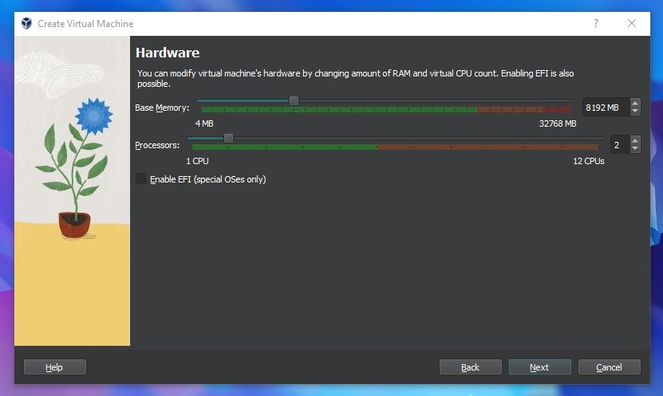
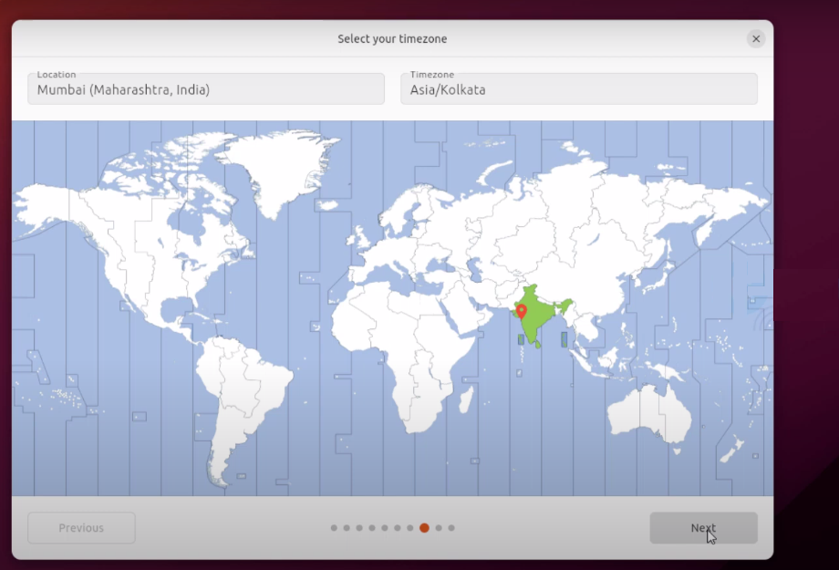

# Linux Install Party :penguin:

This guide will help you to install Ubuntu 23.10.1 (Mantic Minotaur) Daily Build on a virtual machine.

Made with :heart: by Youssef HABIBI ([@YHbibi](https://github.com/YHbibi)).

---

## Prerequisites

- 2 GHz dual-core processor or better
- 8 GB RAM or more
- 25 GB of available disk space minimum
- Make sure virtualization is enabled in your computer’s BIOS/UEFI settings

## Steps

1. [Download an Ubuntu Image](#1-Download-an-Ubuntu-Image)
2. [Download and install VirtualBox](#2-Download-and-Install-Virtualbox)
3. [Create a new virtual machine](#3-Create-a-new-virtual-machine)
4. [Install your image](#4-Install-your-image)
5. [Installing Guest Additions](#5-installing-Guest-Additions)

## 1. Download an Ubuntu Image

You can download an Ubuntu image [here](https://ubuntu.com/download/desktop). Make sure to save it to a memorable location on your PC.
We will use the Ubuntu 23.10.1


> Download may take a while as the file size for Ubuntu 23.10.1 is 4.8 GB

## 2. Download and install VirtualBox

### 1. Download VirtualBox

Download the latest version of VirtualBox from [here](https://www.virtualbox.org/wiki/Downloads).


### 2. install VirtualBox

Once you have completed the installation, run the `.exe` file and install VirtualBox.

## 3. Create a new virtual machine

1. Start VirtualBox, and click on the top menu: `Machine->New` (or press CTRL-N).

   

2. Provide name, for example, Ubuntu 23.10. The type would be set to Linux automatically.

   

3. Set Memory Size = 2048 MB(2GB) and CPU = 1

   

4. Select disk parameters

   Go with the defaults. The minimum recommendations are usually 20-25 GB for a desktop distribution. You choose 25 GB.

   

   > It is recommended not to use "Pre-allocate Full Size" option to save disk space on your computer.

5. You will be now shown a summary of all your selections, and then it is time to launch and initiate installing the Linux OS as a virtual machine.

   

Once everything is in place, it’s time to boot that ISO and install Linux as a virtual operating system.

Once done, click **Finish** .

## 4. Install your image

1. Select the newly created VM at the left pane in the main VirtualBox window. And finally, click Start at the top toolbar. This action will kick-start the Ubuntu installation.

   

   > If VirtualBox doesn’t detect the Linux ISO, browse to its location and select it to start.

2. If all goes well, you should see the Ubuntu installation prompt.

   

3. Choose the language and click `Install Ubuntu`.

   

   

4. You will be asked to select your keyboard layout. Once you’ve chosen one, click `Next`.

   

   > Pay attention if you want to choose AZERTY keyboard

5. Next, you will be prompted to choose between the Normal installation and Minimal installation options. The minimal installation is useful for those with smaller hard drives or who don’t require as many pre-installed applications.In Other options, you will be prompted to download updates as well as third-party software that may improve device support and performance (for example, Nvidia graphics drivers) during the installation. It is recommended to check both of these boxes. If you are not currently connected to the internet, you will be prompted to do so at this point. Ensure you are able to remain connected throughout the installation.

   

6. This screen allows you to configure your installation. If you would like Ubuntu to be the only operating system on your device, select Erase disk and install Ubuntu.

   

7. Select your location and timezone from the map screen and click Continue. This information will be detected automatically if you are connected to the internet.

   

8. On this screen, you will be prompted to enter your name and the name of your computer as it will appear on the network. Finally, you will create a username and a strong password.

   

9. Dark or Light theme

   

10. Now sit back and enjoy the slideshow as Ubuntu installs in the background! :blush:


11. Once the installation has completed, you will be prompted to restart your machine. Click **Restart Now**.


12. After reboot, don’t forget to eject the ISO image from the virtual disk then pressing Enter.


## 5. Installing Guest Additions

Guest Additions is an extra piece of software that unlocks some more advanced features of VirtualBox. This includes better integration between your virtual machine and the host machine.

1. Open a terminal window and run

   ```
   sudo apt update
   sudo apt install build-essential dkms linux-headers-$(uname -r)
   ```

2. Click on `Devices > Insert Guest Additions CD image...`

   

3. The disc will appear inside your virtual desktop and you will be prompted to run the software.

   .png>)

   Enter your password to install it.
   Once this is complete, you will need to restart your virtual machine for the new features to take effect.

# Conclusion

**Having Fun With the Linux Command Line**

The Linux terminal is an efficient tool. You can develop and write commands while carrying out daily tasks and use it to command the entire system.

And remember that Linus Torvalds said :

> In real open source, you have the right to control your own destiny. :wink:
